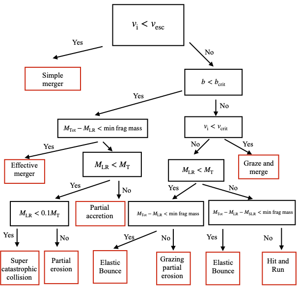

# README

# Fragmentation code
	
`fragmentation.c` is built to model fragmentation in collisions for the C version of REBOUND.  The image below shows the decision tree used to resolve a collision between two massive bodies.  Details may be found in [Childs & Steffen 2022 (MNRAS)](https://watermark.silverchair.com/stac158.pdf?token=AQECAHi208BE49Ooan9kkhW_Ercy7Dm3ZL_9Cf3qfKAc485ysgAAA1YwggNSBgkqhkiG9w0BBwagggNDMIIDPwIBADCCAzgGCSqGSIb3DQEHATAeBglghkgBZQMEAS4wEQQMnL4Yznxh63A6av_WAgEQgIIDCfds3lkvab_I3hziUliJtsoYCnIMeZJXjW_W6tyvEKBMuc1FnqNLhrPgsg9sLnXdD8hrMzbBRFEVnXUjMY0LLM4IcJARStH-Yi33MA1BUHFREei99LVZqBKlB-cM9-Y3LEtuNQAUVlB-2txAK-RvneguwQMmDv8vlhaSf4gJbxuELOTbEVBfYcvQKGlevo7QEQyp7nND9hrUTX0oPMxYhn7BKc5pdRD79obahvyuhW85Ddu4AjakAJnJglqiriHxXC3otc1p5AGa_Skx6VAMPpM4sr0lRs2h74--sXtNLV-BOgqeVI7tKsgtx1HnqNlgLM49Q8gC17cQ-mkZhmbolftyzoGyb4M2WT9ErOUh0aIMcjXaLazrfG9cH5jFWqLGIrk5rWmVVTggDInrcjTFTrwYaDC82dSGsPCNt_GtKzCiMu45rCpqxkd7nCy8ciJXjixsl1XpBYJCKpocFR1tPWirVbEc5jZu-hdj3a3lekrWfzCnUGDR3uWcpy-ci64HZNYJj7IWCTTZpkTSsTbZ7rB1pADVi0irhqHvrg1pMfWwwmpTS1CRKoKpyTaarolRDUmSwyl2k29oHniRmiFXlVx370hxdZWl1djdpK-4XTmSMdjTQIFm7g9RnAuNyrC8yFkZnQ-hd9NFpyn1rRXeNBf3gXlm5q1A474xpj_M5RnH0YgELnMSHBCNRt8aCAfR7SyEuPbqe-drRgMuc3qXKI03MUj1MJqgvXDQNWVU-1xPAhsOiLc4eIzjLCw2pF-sjhOV1c_aCT9WH2UTVT8tGWONZU4pZlklOnz7W6gBB4JaUeQyKFZxiRKxn4u3h6vGLxpE3ZEvtCfbjnCrfeNCqly9vDGcmHOXtwODxKWrpnpBZDB0aGDWvy5rHS6WWkAB0dG93ydX1_jbPgNCT8z5EmV78gCpoAV-zzPkkmN7fBupraF3raOPn4Qb9er_VDiR1igdFyTgHSRiA4b3a_VaaiDeyPrycojZvD2Voqx2ij1NlKCQ-FJTyq6IIdAYkIN5u9EgnKRsEDkKrw).  An example `problem.c` file with the fragmentation code may be found above.
 
To use the code, copy and paste fragmentation.c into the problem.c file you wish to use fragmentation with.  Set `r->collision_resolve = reb_collision_resolve_fragment;` in the `main()` function to call the fragmentation code.  Two global pararameters need to be set by the user: `double min_frag_mass` and `int tot_no_frags`.  These two parameters can be found at the top of fragmentation.c and have default values set to `double min_frag_mass = 1.4e-8;` and `int tot_no_frags = 0;`.  `double min_frag_mass` is the minimum mass a fragment may have.  This needs to be defined such that the number of bodies does not grow too large and halt the simulation.  `int tot_no_frags` is the total number of frags (an integer) in the system when starting a simulation.  IMPORTANT: If you are starting a simulation from `t=0`, then `int tot_no_frags = 0;`.  If you are restarting a simulation from an archive file, then `int tot_no_frags =` maximum number of fragments produced in the simulation before your restarting point (it's also fine to set this parameter to a number higher than the maximum number of fragments previously produced).  This must be done so that new fragments added to the simulation recieve unique hashes that correspond to the fragment number.  IMPORTANT: If you plan on using the bulk composition tracking code, each body (ALL bodies including the star(s)) must be assigned a unique hash before the start of the integration.

The `fragmentation.c` code will automatically produce a `collision_report.txt` which details the time of every collision, the bodies involved, how the collision was resolved, and how many fragments were produced.  Collision outcomes are assigned a numerical value: 0=elastic bounce, 1=merger, 2=partial accretion, 3=partial erosion, 4=supercatastrophic disruption.  This report is necessary for running the bulk composition tracking code.

# Bulk composition tracking code

The bulk composition tracking code tracks the composition change as a function of mass exchange for bodies with a homogenous composition.  This code is a post-processing code that works in conjunction with `fragmentation.c` for REBOUND.  IMPORTANT: If you plan on using the bulk composition tracking code, each body (ALL bodies including the star(s)) must be assigned a unique hash before the start of the integration.  This is necessary so that the bodies may be tracked accurately throughout the entire simulation.

To run: `composition_tracking.py` must be installed and compiled with `chmod +x composition_tracking.py` in the same file as the input files.  Run with `./composition_tracking.py`

Input files: `composition_input.txt`, `collision_report.txt`

Output files: `composition_output.txt`

Format of input files:

- `collision_report.txt` will be generated by `fragmentation.c` for REBOUND.

- `composition_input.txt` must be generated by the user.  Each body must be assigned a unique hash at the START of the integration.  Each body must be assigned a composition in `composition_input.txt` (ALL bodies including the star(s)). Each body will be on it's own row.  The first column is body hash, second column is body mass, and for j species/elements being tracked, the next j columns will have the mass fraction in decimal form of each specie/element.  No delimiters should be added.  All values should be separated by whitespace and each specie should have it's own column.  All values should be an int or float data type.  The relative abundances for each body should add up to 1.0. Please see example_composition_input.txt for an example of the input format for a system with 200 bodies and 5 different species/elements.

Format of output files:
	`composition_output.txt` will output the final compositions of all the bodies.  The format of the output file will be in the same form as the `composition_input.txt` file: body hash in first column, body mass in second column, body mass fraction of specie j in the 2+jth column.
  
 If either code is used please cite [Childs & Steffen 2022 (MNRAS)](https://watermark.silverchair.com/stac158.pdf?token=AQECAHi208BE49Ooan9kkhW_Ercy7Dm3ZL_9Cf3qfKAc485ysgAAA1YwggNSBgkqhkiG9w0BBwagggNDMIIDPwIBADCCAzgGCSqGSIb3DQEHATAeBglghkgBZQMEAS4wEQQMnL4Yznxh63A6av_WAgEQgIIDCfds3lkvab_I3hziUliJtsoYCnIMeZJXjW_W6tyvEKBMuc1FnqNLhrPgsg9sLnXdD8hrMzbBRFEVnXUjMY0LLM4IcJARStH-Yi33MA1BUHFREei99LVZqBKlB-cM9-Y3LEtuNQAUVlB-2txAK-RvneguwQMmDv8vlhaSf4gJbxuELOTbEVBfYcvQKGlevo7QEQyp7nND9hrUTX0oPMxYhn7BKc5pdRD79obahvyuhW85Ddu4AjakAJnJglqiriHxXC3otc1p5AGa_Skx6VAMPpM4sr0lRs2h74--sXtNLV-BOgqeVI7tKsgtx1HnqNlgLM49Q8gC17cQ-mkZhmbolftyzoGyb4M2WT9ErOUh0aIMcjXaLazrfG9cH5jFWqLGIrk5rWmVVTggDInrcjTFTrwYaDC82dSGsPCNt_GtKzCiMu45rCpqxkd7nCy8ciJXjixsl1XpBYJCKpocFR1tPWirVbEc5jZu-hdj3a3lekrWfzCnUGDR3uWcpy-ci64HZNYJj7IWCTTZpkTSsTbZ7rB1pADVi0irhqHvrg1pMfWwwmpTS1CRKoKpyTaarolRDUmSwyl2k29oHniRmiFXlVx370hxdZWl1djdpK-4XTmSMdjTQIFm7g9RnAuNyrC8yFkZnQ-hd9NFpyn1rRXeNBf3gXlm5q1A474xpj_M5RnH0YgELnMSHBCNRt8aCAfR7SyEuPbqe-drRgMuc3qXKI03MUj1MJqgvXDQNWVU-1xPAhsOiLc4eIzjLCw2pF-sjhOV1c_aCT9WH2UTVT8tGWONZU4pZlklOnz7W6gBB4JaUeQyKFZxiRKxn4u3h6vGLxpE3ZEvtCfbjnCrfeNCqly9vDGcmHOXtwODxKWrpnpBZDB0aGDWvy5rHS6WWkAB0dG93ydX1_jbPgNCT8z5EmV78gCpoAV-zzPkkmN7fBupraF3raOPn4Qb9er_VDiR1igdFyTgHSRiA4b3a_VaaiDeyPrycojZvD2Voqx2ij1NlKCQ-FJTyq6IIdAYkIN5u9EgnKRsEDkKrw).
 
 For questions, comments or bugs please email anna.childs@northwestern.edu

Acknowledgements:
I thank Hanno Rein for his assistance in the develoment of this code.  I thank Noah Ferich, Agustín Dugaro and Haniyeh Tajer for assistance with debugging.
	
